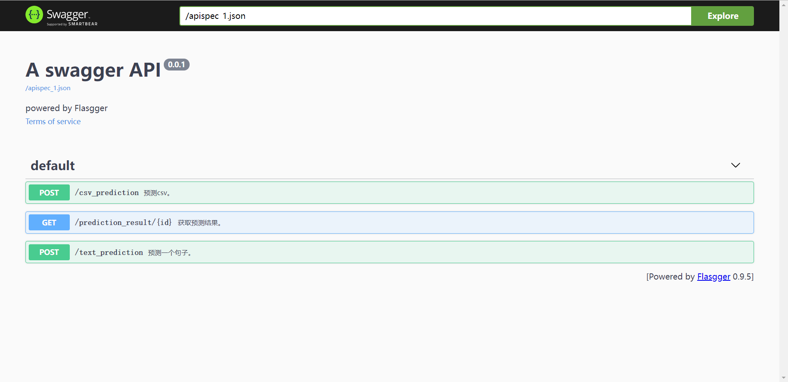
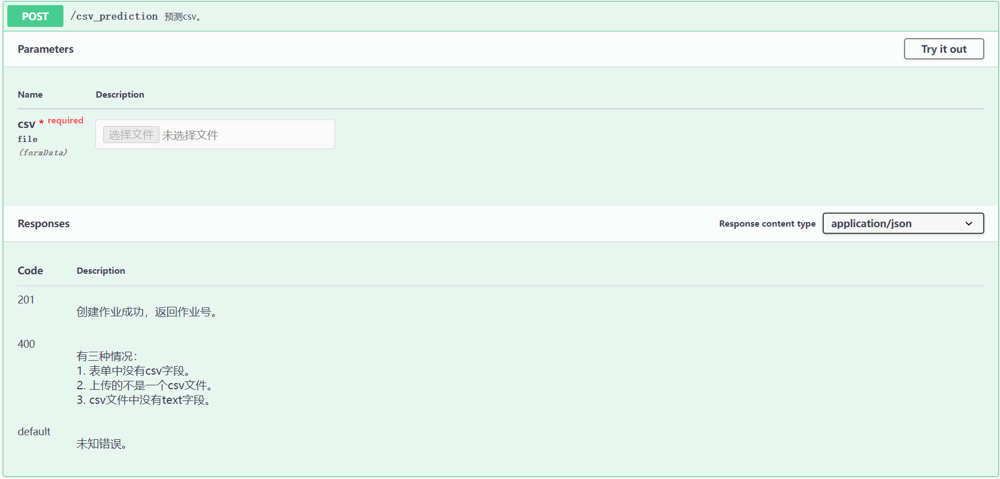
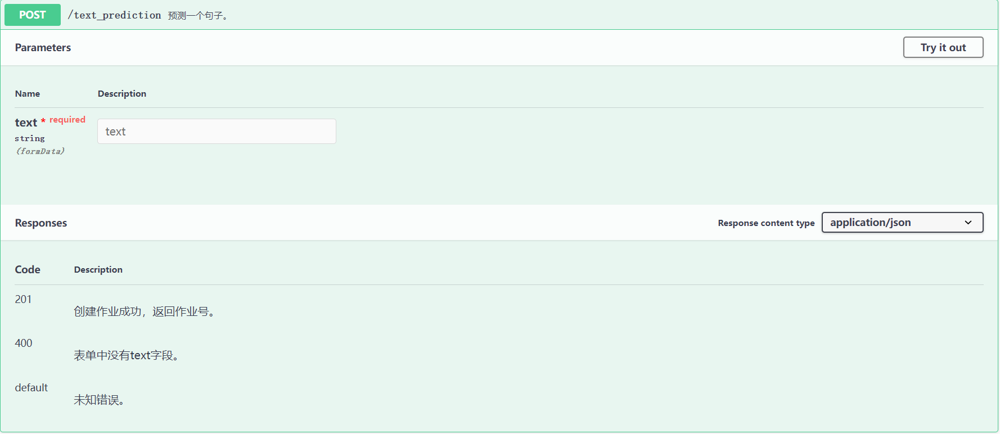
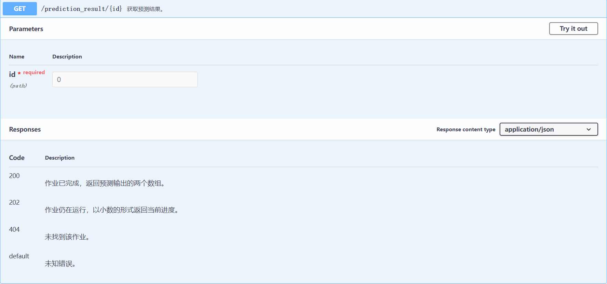

# COV19

该项目是COVID-19话题的推特进行情感分析的**后端**部分，完成了以下工作：

1. 使用docker打包部署。
2. 使用flask作为后端框架，提供RESTful API。
3. 使用swagger生成文档。

## 项目目录结构

首先介绍项目的目录结构，整个项目目录如下：

```
.
|-- .devcontainer
|   |-- devcontainer.json       # vscode远程容器开发配置
|   `-- docker-compose.yml      # 开发环境配置，覆盖了生产环境配置的一些选项
|-- .dockerignore
|-- .gitignore
|-- Dockerfile                  # 构建开发环境和生产环境所需镜像
|-- README.md
|-- __pycache__
|-- app.py                      # flask应用
|-- cache
|   `-- huggingface             # 预训练模型的缓存目录
|       `-- transformers
|-- docker-compose.yml          # 生产环境配置
|-- requirements-dev.txt        # 开发环境下所需的python包
`-- requirements.txt            # 生产环境下所需的python包
```

## docker

项目的开发环境和生产环境都是使用docker进行搭建的，开发环境需要更多的配置，因此开发环境的配置是基于生产环境配置上进行修改的。

### 运行

运行该项目需要先安装docker和docker-compose，然后进入项目目录，输入以下命令即可：

```
docker-compose up
```

服务默认部署在主机的5000端口，如果部署在本地，访问文档的链接为`http://127.0.0.1:5000/apidocs`。

### Dockerfile

#### 生产环境

项目需要加载模型，因此所构建镜像是基于`pytorch/pytorch:1.10.0-cuda11.3-cudnn8-runtime`镜像的，该镜像包含了python3.7、pytorch1.10.0、cuda11.3、cudnn8，能够使用CPU或GPU来运行模型。

模型需要的其它包pandas、transformers，以及后端需要的flask、flasgger定义在requirements.txt中。使用Dockerfile构建镜像时会读取该文件的内容，安装对应的库。

#### 开发环境

在Dockerfile中，定义了一个`DEV`参数，作为开关选择是否构建开发环境。开发环境会安装一些额外的软件，以及python包。

额外软件在Dockerfile中用`ARG`变量定义。在apt安装软件时，由于缓存问题可能导致镜像构建失败，将`apt install -y ${PKG}`改为`(apt install -y ${PKG} || apt install -y ${PKG} --fix-missing)`可以解决该问题。

requirements-dev.txt中说明了需要额外安装的python包。其中black是一个python的格式化程序。

### docker-compose.yml

项目根目录中的docker-compose.yml配置了生产环境。用于定义预训练模型的缓存目录、挂载缓存目录、映射端口以及分配GPU。

.devcontainer/docker-compose.yml配置了开发环境。它基于生产环境的配置，修改了镜像名、设置了`DEV`参数、以及配置了`FLASK_ENV`环境变量。

.devcontainer/devcontainer.json是vscode远程容器开发配置，用于指示vscode进行一系列的自动化操作。在系统安装了docker和docker-compose的情况下，只需几次鼠标点击就能进入开发环境。

## 后端

后端的主要任务是接受输入、用模型对输入预测、返回预测预测结果。除此外，后端也提供了具体的文档说明。另外，预处理模型加载时间较长，因此采用了线程来加载模型。在实现各类接口的过程中，严格遵守RESTful API的设计规范，接口中的错误处理覆盖较为全面。

后端提供了四个接口：
- 输入一个句子，返回作业号。
- 输入一个csv文件，返回作业号。
- 查询预测结果，如果未完成则返回一个进度，已完成则返回预测结果。
- 文档。

### 模型加载

后端启动时将会开启一个初始化线程，用于做一系列耗时的初始化操作，其中包括了模型加载。

### 作业

由于模型进行预测的时间可能会很长，如果在响应的过程中做预测就会导致客户端长时间无法得到响应，因此引入了作业的概念：
- 当客户端发送一个“输入请求”时，服务端将会建立一个作业，并将该作业的作业号立即返回，状态码为201。
- 创建作业会开启一个新的工作线程，处理输入。
- 当客户端发送一个“获取结果请求”时，客户端将之前的作业号传递给服务端，服务端将会根据该作业号查询作业是否已经完成。如果没有完成，则以小数的形式返回当前进度。如果完成了，则以json格式返回输出的两个数组。

### 文档

后端的文档使用了swagger来生成，swagger能很好的描述RESTful API，除此外，swagger提供了交互功能，文档的阅读者能够通过点击执行按钮来运行API，而无需使用任何其它工具。

在文档中，较为详细的描述了三个接口的功能。

#### swagger界面


#### POST /csv_prediction



#### POST /text_prediction



#### GET /prediction_result


