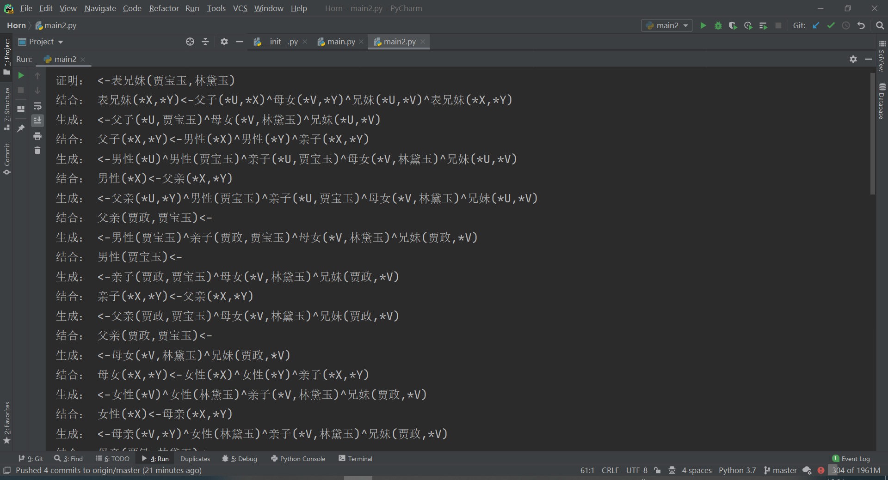

# Horn
Horn子句推导系统

# 示例 Happy John

# 结果

# wait
### 代码肿么写?
### 简单易用：

规则照着正常的horn子句抄，唯一不同就是全体变量前面多添个星号就是了。之后想proof啥就proof啥。

# 更高级点的示例：贾宝玉和林黛玉

代码咱就不放出来了，在文件中有

# 看一下结果

瞧瞧这令人恐惧的滚动条，真的是证明之大，一页放不下啊。

# 结语
耗时两天写完这个系统，感觉收益真的颇多。原本以为还算了解的horn子句，在写的过程中各种出错。每次遇到困难，就回去探望一下John，然后发现又写的下去了。老师的PPT是真的强啊！这不是舔，嘿嘿！
